# Naver Crawler System — 시스템 도식화

## 1. 전체 에이전트 조직도

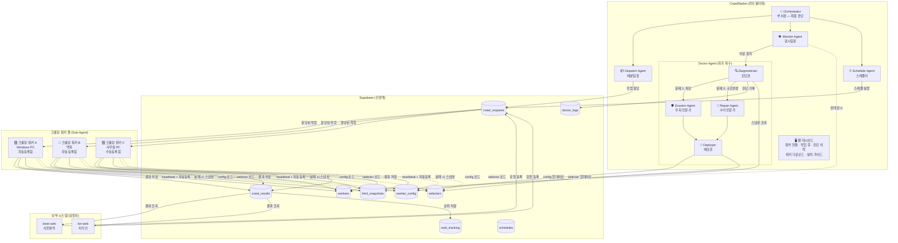

## 2. 크롤링 워커 등록 흐름 (자동 + 수동)

```mermaid
flowchart TD
    subgraph "자동등록 (기본)"
        START["새 PC에 크롤링 워커 설치"]
        START --> RUN["python worker.py 첫 실행"]
        RUN --> CHECK_ID{".env에<br/>WORKER_ID 있나?"}
        CHECK_ID -->|없음| GEN["UUID 자동 생성<br/>worker-a1b2c3d4"]
        CHECK_ID -->|있음| USE["기존 ID 사용"]
        GEN --> SAVE_ENV[".env에 WORKER_ID 저장"]
        SAVE_ENV --> COLLECT
        USE --> COLLECT["머신 정보 수집<br/>OS · hostname · IP · Python버전"]
        COLLECT --> UPSERT["workers 테이블에 UPSERT<br/>registered_by = 'auto'"]
        UPSERT --> HB["heartbeat 시작 (5초마다)"]
        HB --> DASH["✅ CrawlStation 대시보드에<br/>즉시 표시"]
    end

    subgraph "수동등록"
        MANUAL["CrawlStation > 워커 관리<br/>> 수동 등록"]
        MANUAL --> INPUT["이름, ID 입력"]
        INPUT --> INSERT["workers 테이블에 INSERT<br/>registered_by = 'manual'<br/>status = 'pending'"]
        INSERT --> GEN_ENV[".env 파일 생성<br/>(WORKER_ID + Supabase 인증)"]
        GEN_ENV --> COPY["워커 PC에 .env 복사"]
        COPY --> RUN2["python worker.py 실행"]
        RUN2 --> HB2["heartbeat 시작"]
        HB2 --> DASH2["✅ 상태: pending → online"]
    end

    style DASH fill:#c8e6c9
    style DASH2 fill:#c8e6c9
```

## 3. 크로스 플랫폼 설치 흐름

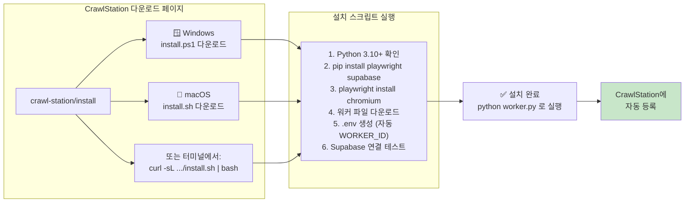

## 4. 자가 복구 흐름 (Doctor Agent)

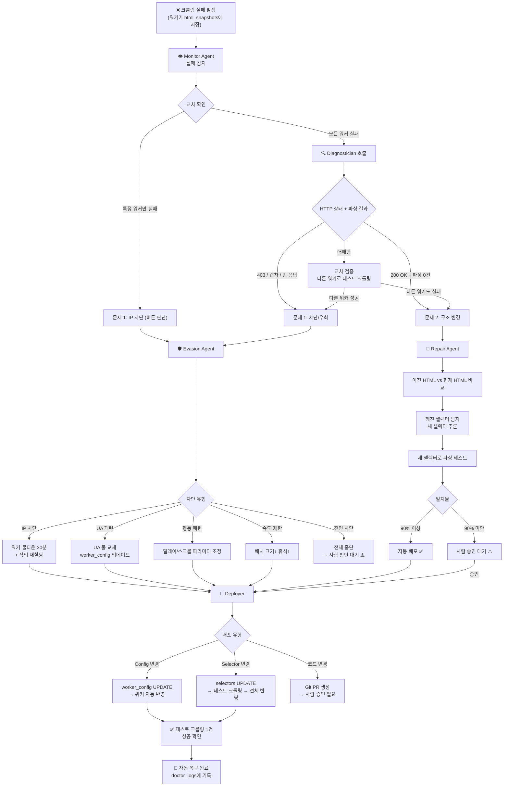

## 5. 크롤링 워커 동작 흐름

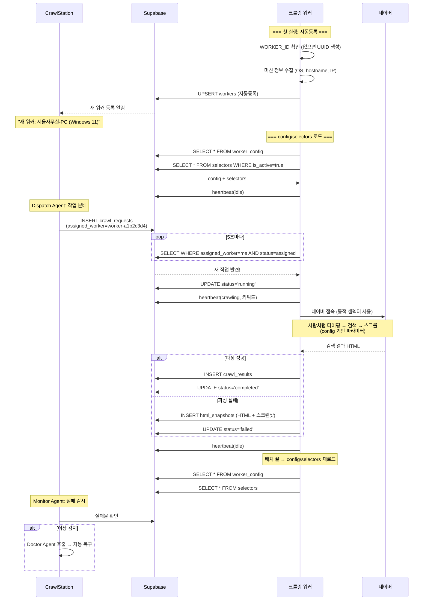

## 6. 작업 분배 흐름 (Dispatch Agent)

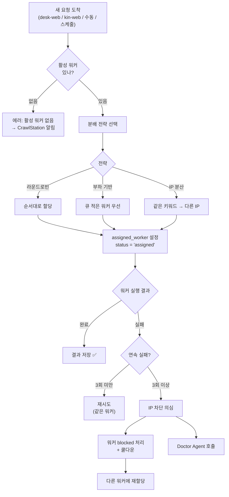

## 7. 셀렉터 외부화 구조

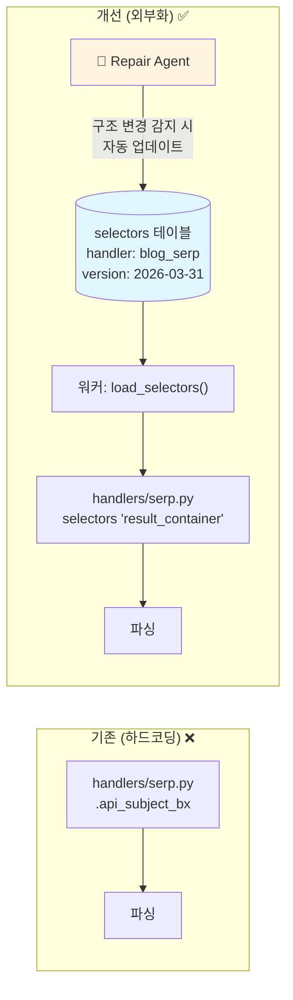

## 8. 순위 모니터링 구조 (rank_check)

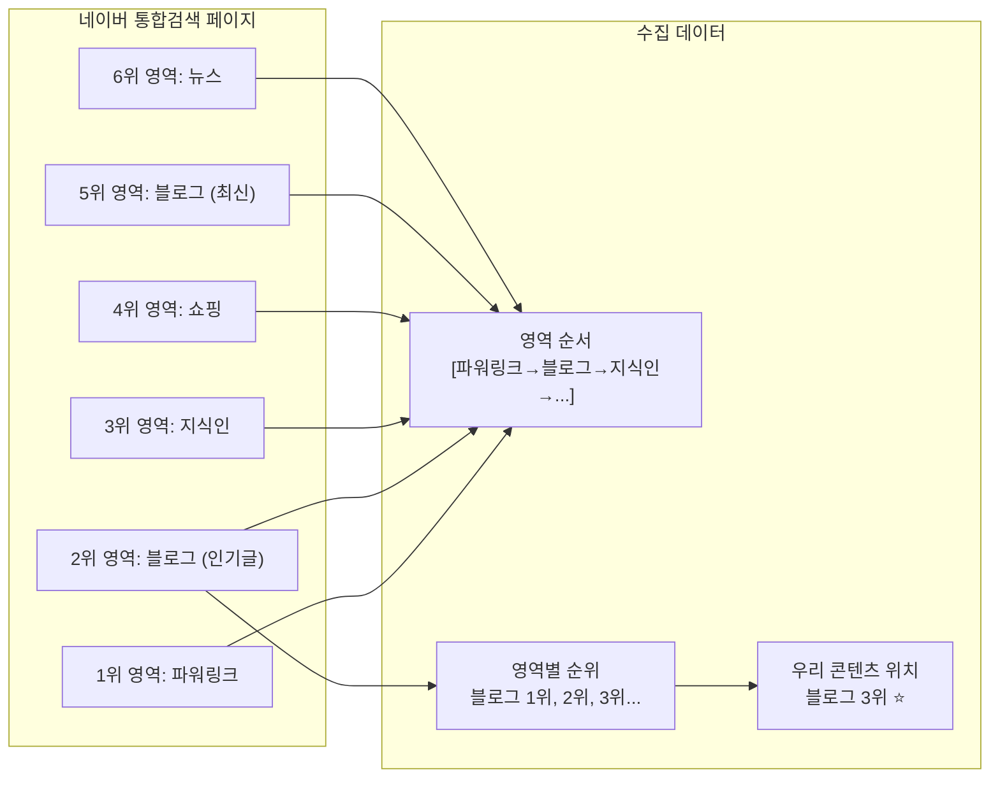

## 9. 일일 모니터링 타임라인

```mermaid
gantt
    title 일일 3,000 키워드 모니터링 (워커 5대)
    dateFormat HH:mm
    axisFormat %H:%M

    section 크롤링 워커 A (600개)
    배치 1 (30개)      :a1, 02:00, 15m
    휴식               :a2, after a1, 3m
    배치 2 (30개)      :a3, after a2, 15m
    휴식               :a4, after a3, 3m
    ...계속 (20배치)    :a5, after a4, 180m

    section 크롤링 워커 B (600개)
    배치 1             :b1, 02:00, 15m
    휴식               :b2, after b1, 3m
    배치 2             :b3, after b2, 15m
    ...계속            :b5, after b3, 183m

    section 크롤링 워커 C~E
    동시 실행           :c1, 02:00, 240m
```

## 10. 프로젝트 관계도

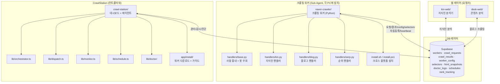

## 11. 봇 탐지 우회 전략 (Config 기반)

```mermaid
mindmap
  root((봇 우회<br/>worker_config 기반))
    브라우저
      navigator.webdriver = false
      window.chrome 위장
      랜덤 뷰포트
      UA 로테이션 ← ua_pool[]
    행동
      마우스 랜덤 이동
      클릭 좌표 흔들림
      타이핑 ← typing_speed_min~max
      오타 5% → 백스페이스
      자동완성 구경
    스크롤
      불규칙 ← scroll_min~max
      가끔 위로 되돌림
      smooth 스크롤
    시간
      키워드간 ← keyword_delay_min~max
      배치 ← batch_size + batch_rest_seconds
      일일 한도
    네트워크
      세션 분리 (키워드마다)
      멀티 IP (워커 분산)
      시간대 분산
    자동 조정
      Evasion Agent가 차단 감지 시
      worker_config 자동 업데이트
      워커가 다음 배치에 반영
```

## 12. CrawlStation 대시보드 화면 구성

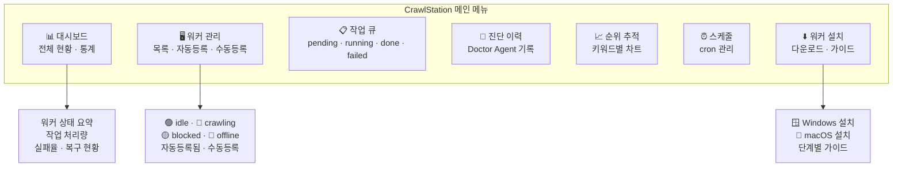

## 13. 개발 로드맵 흐름

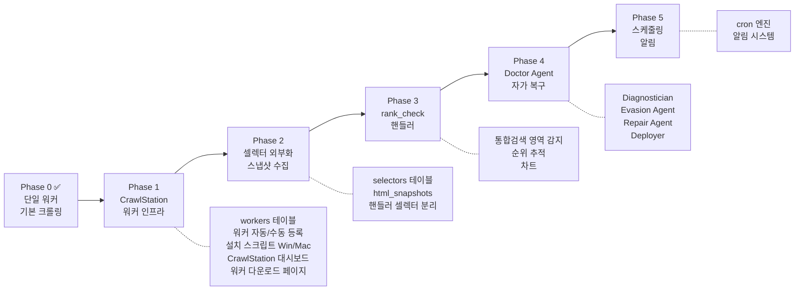
